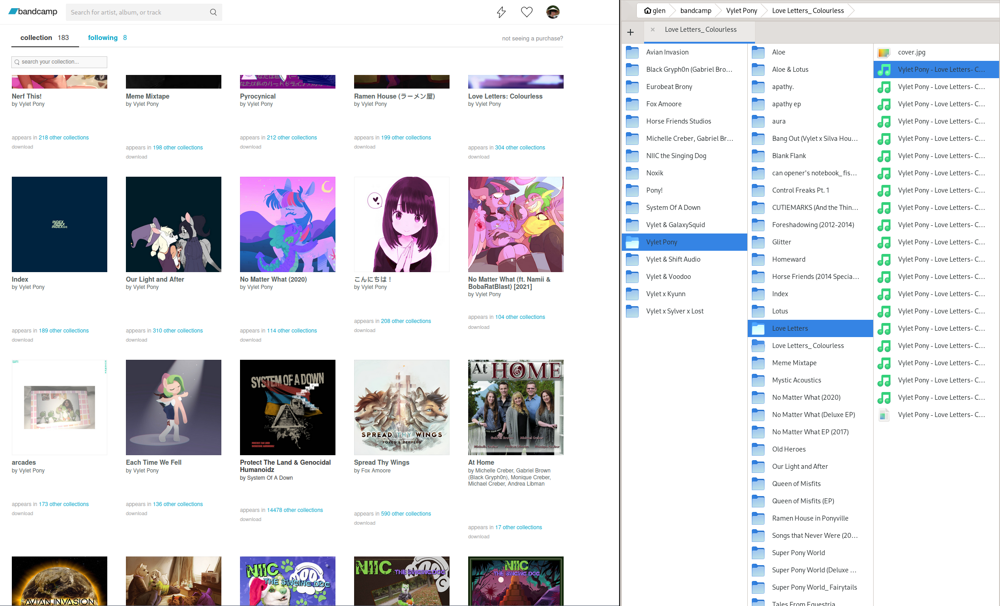

# Bandcamper

<a href="https://github.com/goakley/bandcamper/actions?query=branch%3Amain"></a>


Bandcamper is a tool for syncing your [Bandcamp](https://bandcamp.com/) music collection to your computer.



## Usage

Either download a [pre-built version of the tool](https://github.com/goakley/bandcamper/releases/) or build the executable yourself (see below).

The simplest way to run the tool is to execute it directly (either by clicking it or through the command line).
This will prompt you to pick the folder in which you want to download your music.

If you want to run the program in an environment with no GUI, pass the path to your music folder as the first argument to the program:

* On Windows: `bandcamper %USERPROFILE%\Music\Bandcamp`
* On Mac / Linux: `bandcamper ~/Music/Bandcamp`

Run `bandcamper --help` for details on alternate invocations.

## Building

This tool is a standard Rust Cargo project, and can be built and run as such:

```
git clone git@github.com:goakley/bandcamper.git
cd bandcamper
cargo build
./target/debug/bandcamp ...
```
